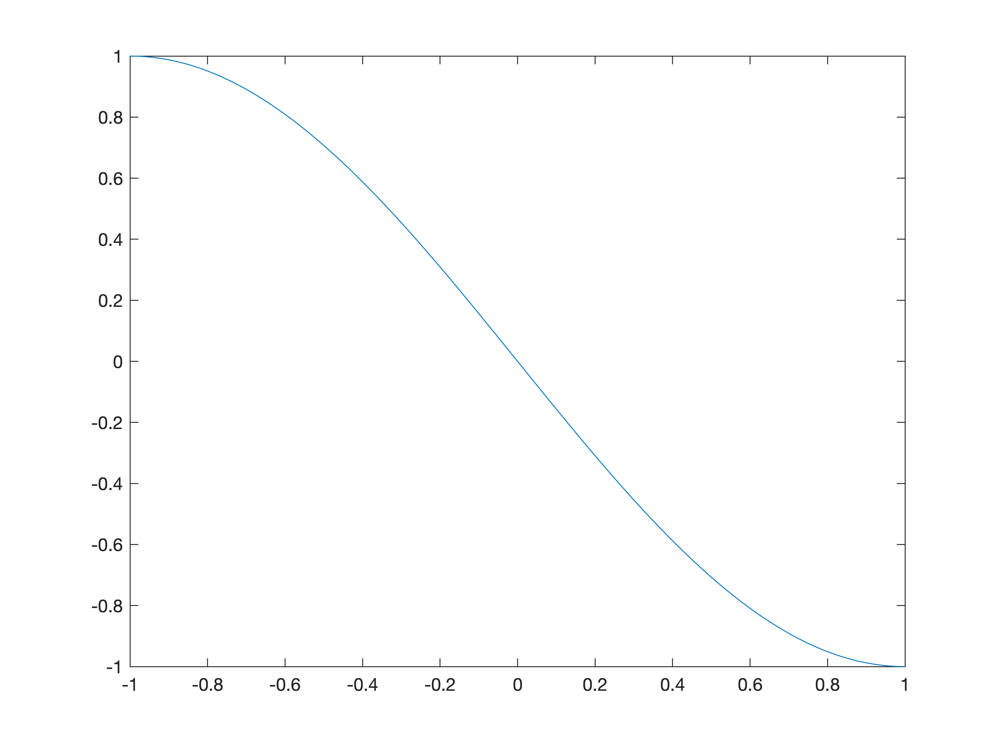

We wish to find a function with infinite number of saddle points:

$$
\begin{aligned}
x + 1 = 2\cdot k + v \\
k = \mathsf{quotient}(x + 1, 2) \\
v = \mathsf{remainder}(x + 1, 2) \\
g(x) = 
-2 \cdot k - \sin\left(\frac{\pi}{2}(v-1)\right) 
\end{aligned}
$$
or equivalently,
$$
g(x) = 
-\sin\left(\frac{\pi}{2}(x-2k)\right) - 2k,\qquad x \in (2k-1, 2k + 1]\\
$$

- In $(-1, 1]$ $(k=0)$,
  - $x=-1, g = 0$,
  - $x=0, g = 0$,
  - $x=1, g = -1, g'(x) = 0, g''(x) > 0$

- Then $g(x)$ repeats the patten of $[-1, 1]$ where $g(x) = - \sin\left(\frac{\pi}{2}x\right)$.

- Suppose we start from very far $x > 0, y >0$ and **`maximize`** a 2-D function:

$$
f(x, y) = - g(x)\cdot g(y)
$$

at $k$-th piece,

$$
\begin{aligned}
    f_x =  g(y) \cdot \frac{\pi}{2}\cos\left(\frac{\pi}{2}(x-2k)\right) = 0,
\end{aligned}
$$
we have two cases,
$$
\begin{cases}
        g(y) = 0 \\
        \cos\left(\cdot\right) = 0
    \end{cases}\Rightarrow
    \begin{cases}
        y = 0 \\
        x = 2k + 1，
    \end{cases}
$$
similarly, consider,
$$
f_y = 0 \Rightarrow \begin{cases}
        x = 0 \\
        y = 2k + 1，
    \end{cases}
$$
and second-order derivatives,
$$
\begin{aligned}
&f_{xx} = - g(y) \cdot \frac{\pi^2}{4}\sin\left(\frac{\pi}{2}(x-2k)\right)\\
&f_{xy} = + \frac{\pi^2}{4} \cos(\cdot) \cos(\cdot) \equiv 0
\end{aligned}
$$

- at $(x,y) = (2k+1, 2k+1)$,
$$
\begin{aligned}
&f_{xx} = -\frac{\pi^2}{4} g(y) = 2k + 1 > 0\\
&f_{xy} = \frac{\pi^2}{4} \cos(\cdot) \cos(\cdot) = 0\\
&H \succeq 0
\end{aligned}
$$

- at $(x,y) = (2k+1, 0)$,
$$
\begin{aligned}
&f_{xx} = -\frac{\pi^2}{4} g(y) = 0\\
&f_{xy} = \frac{\pi^2}{4} \cos(\cdot) \cos(\cdot) = 0\\
&H = 0
\end{aligned}
$$

- at $(x,y) = (0, 0)$,
$$
\begin{aligned}
&f_{xx} = -\frac{\pi^2}{4} g(y) = 0\\
&f_{xy} = \frac{\pi^2}{4} \cos(\cdot) \cos(\cdot) = \frac{\pi^2}{4} > 0 \\
& H\preceq 0
\end{aligned}
$$

So, $(x,y) = (0, 0)$ is the only maximum and $(x,y) = (2k+1, 2k+1), \forall k$ are saddle points (remember we are maximizing)